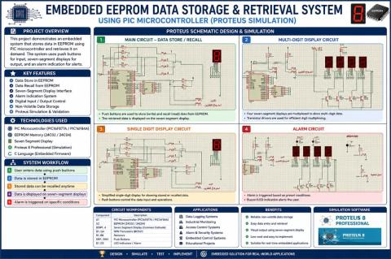
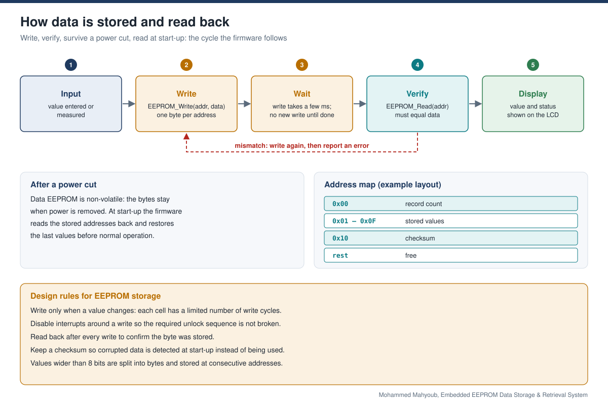

# Embedded EEPROM Data Storage & Retrieval System

[Read case study](https://mahyoub88.github.io/projects/proj-eeprom-storage/) · [Project index](docs/PROJECTS.md)

An embedded system that stores data in the PIC microcontroller's on-chip EEPROM and reads it back, so values survive a power cut. The implementation uses mikroC firmware, with Proteus supporting schematic development and verification.

**Author:** Mohammed Mahyoub · [Portfolio](https://mahyoub88.github.io/projects/)

> The poster is available at preview resolution. The original Proteus schematic and complete firmware are not part of this public release; the snippet below is explanatory reference code.

## At a glance

| Aspect | Detail |
|---|---|
| Controller | PIC microcontroller |
| Storage | On-chip data EEPROM (non-volatile) |
| Function | Store values, read them back, keep them across power loss |
| Development | Firmware in mikroC, schematic design and simulation in Proteus |

## How data is stored and read back

The firmware writes each value to an EEPROM address, waits for the write to finish, reads the byte back to confirm it, and shows the result on the display. Because data EEPROM is non-volatile, the stored values are still there after the power is removed, and the firmware restores them at start-up.

## Design rules

- Write only when a value changes, because each EEPROM cell has a limited number of write cycles.
- Follow the selected PIC device and mikroC library requirements for protecting the write-unlock sequence and preserving interrupt state.
- Read back after every write to confirm the byte was stored.
- Keep a checksum so corrupted data is detected at start-up.
- Split values wider than 8 bits into bytes at consecutive addresses.

## Reference snippet (mikroC style)

~~~c
void store_byte(unsigned char addr, unsigned char value) {
  if (EEPROM_Read(addr) == value) return;   // unchanged: save a write cycle
  EEPROM_Write(addr, value);
  Delay_ms(20);                             // let the write complete
  if (EEPROM_Read(addr) != value) {
    /* report a write error */
  }
}
~~~

## Technologies

PIC microcontroller, data EEPROM, mikroC, Proteus, LCD display, non-volatile storage

## Related

- [Embedded Systems & IoT — PIC Firmware and Peripheral Integration](https://github.com/Mahyoub88/embedded-iot-automation)
- [Industrial Automation & PLC-Based Control Systems](https://github.com/Mahyoub88/industrial-automation-plc)
- [All projects](https://mahyoub88.github.io/#work)
